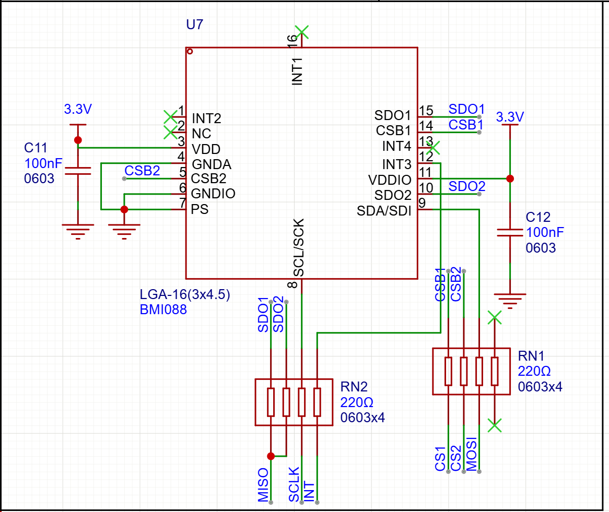

# SPI

## 状态

进行中

## 日期

- 开始日期：2026.9.6
- 最近更新：2026.9.6

## 理论知识

- BMI088的SPI通信，普通spi通信走四根线SCLK/SCL时钟线，CS片选,SDA/SDI输入，SDO输出,bmi088有两个传感器，因此需要两个CS进行传感器读取的选择，然后SDO也得要两个用于输出不同传感器，SDA/SDI只要一个用来接收单片机数据，MOSI，master out slave in对应就是SDA/SDI，MISO就是对应SDO，接排阻的原因不是很明白啊，各个引脚也都是抄的，没有仔细看技术手册
  

## 实践

## 问题

## 参考资料

