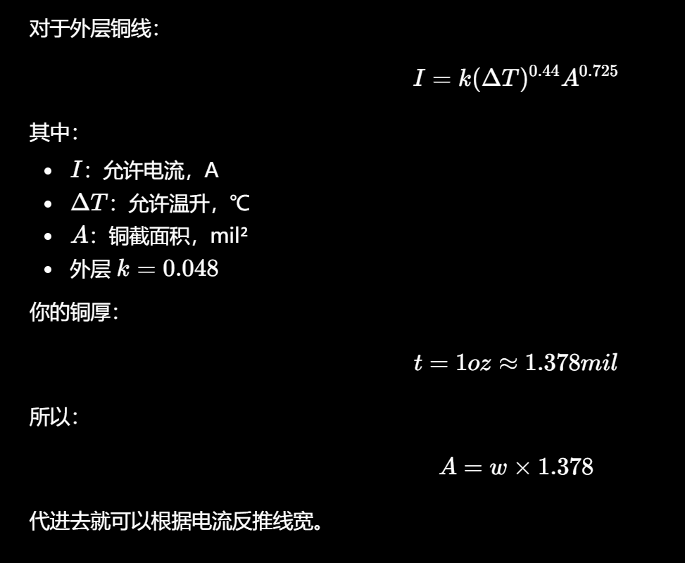
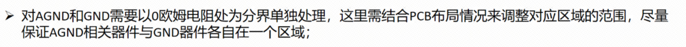
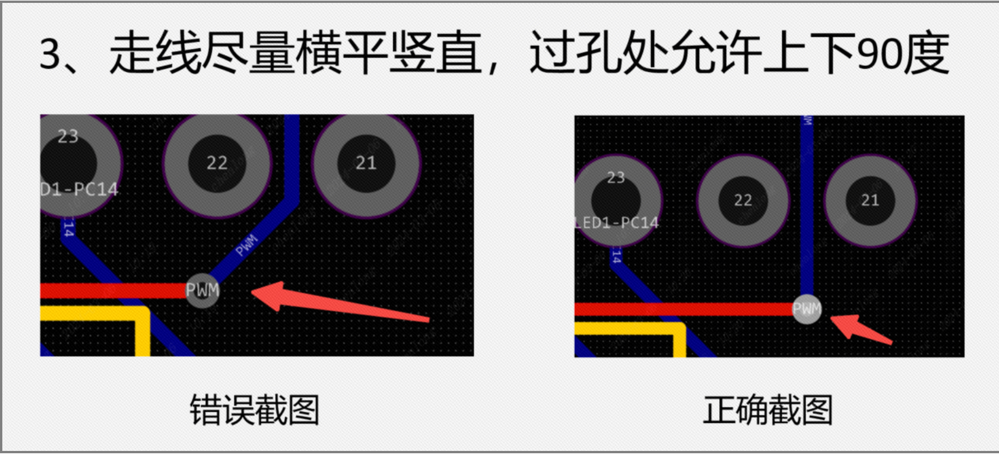
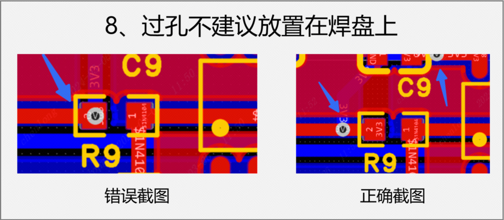

# Layout

## 状态

进行中

## 日期

- 开始日期：2026.9.7
- 最近更新：2026.9.9

## 理论知识

layout回忆一下

- 芯片滤波电容靠近电源引脚摆放
- 走线长度尽量短,走向沿焊盘方向引出
- 避免产生锐角和直角,产生不必要的辐射干扰
- 不允许浮空走线
- 电源滤波去耦电容保证电流先流过电容滤波再给器件供电
- 保证信号线预取贿赂面积尽可能小,最小回路原则
- 尽量加宽电源与地线宽度
- 通常项目信号线10mil,电源走线20mil,大于1A应计算
  
- 优先使用顶层走线

- 走线后可添加泪滴,加强焊盘与走线的连接,再进行覆铜,shift+B重建覆铜

## 实践

- layout初步布局
- layout乱搞,原理图引脚得和pcb商量好
- 看看imu,pcb

## 问题

## 参考资料

