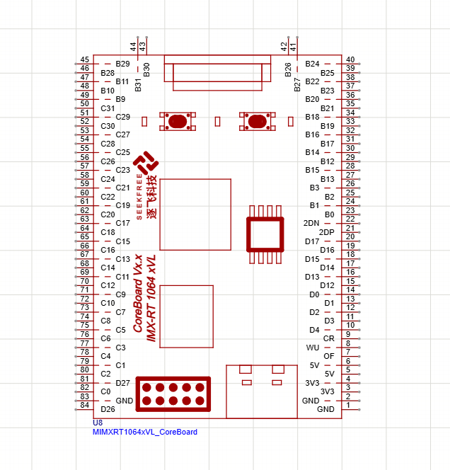

# 原理图

## 状态

进行中

## 日期

- 开始日期：2026.9.6
- 最近更新：2026.9.9

## 理论知识

## 实践

- 下载了破解版AD，和转换脚本,看b站视频准备导入原理图库和封装库
- AD库转嘉立创脚本成功，改路径，ad运行脚本，打包zip，导入嘉立创OKK,
  
- 完成原理图把，接口长啥样看看，不想用排针，原理图基本完成还要叫ai查一下

## 问题

- 电源要形成网络不可以只连线?

## 参考资料

