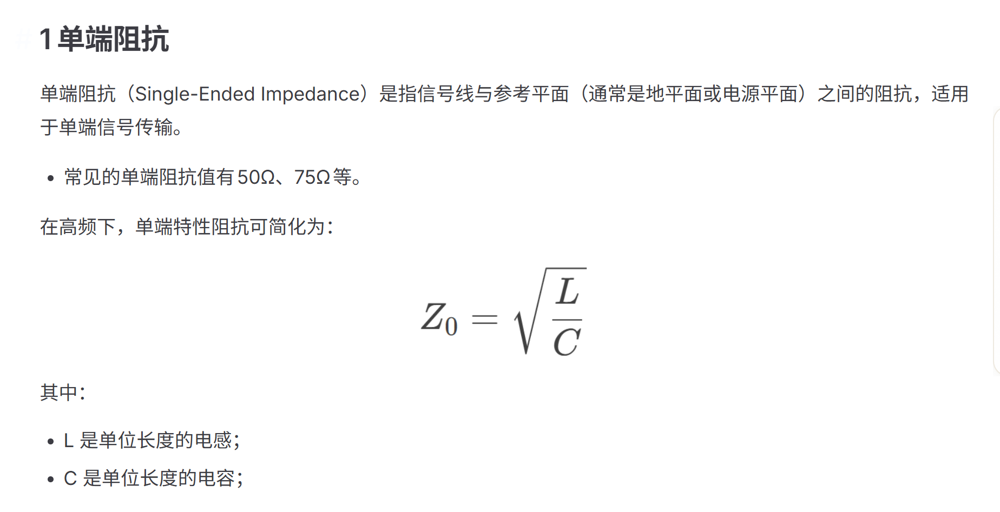
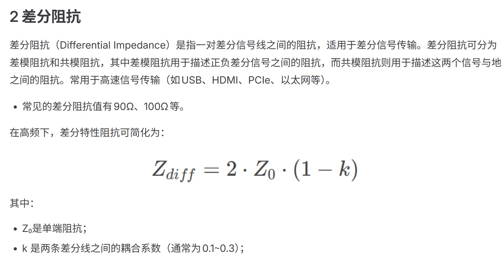

# 阻抗

## 状态

进行中

## 日期

- 开始日期：2026.9.8
- 最近更新：2026.9.8

## 理论知识

- 什么是特性阻抗?特性阻抗是电磁波在传输线中传播时遇到的阻抗，反映了信号传输的质量和效率。在PCB设计中，控制特性阻抗对确保信号完整性和减少反射至关重要,一般都是高速信号线里面,公式Z=根号下L/C,普通信号的信号上升沿相对于走线传播时间很慢呐
  
  

## 实践

## 问题

## 参考资料

