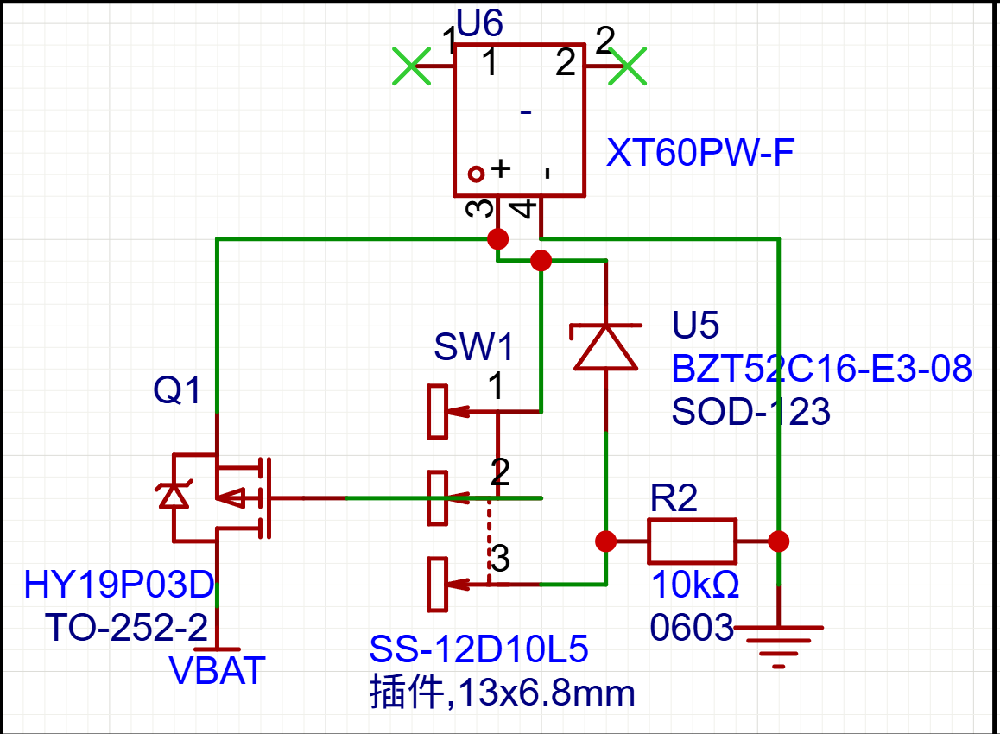

# MOS

## 状态

进行中

## 日期

- 开始日期：2026.9.6
- 最近更新：2026.9.6

## 理论知识

- 一个mos的应用，source直接接电源，拨码开关接1,2时驱动栅极正常导通，接2,3时默认下拉电阻不导通，但是电源电压很大的时候通过稳压二极管给栅极一点电压，不至于source和栅极电压过大，同时保护了开关，延长寿命吗，mos管用电压，稳压二极管：电压击穿时有稳定的压降
  

## 实践

## 问题

## 参考资料

