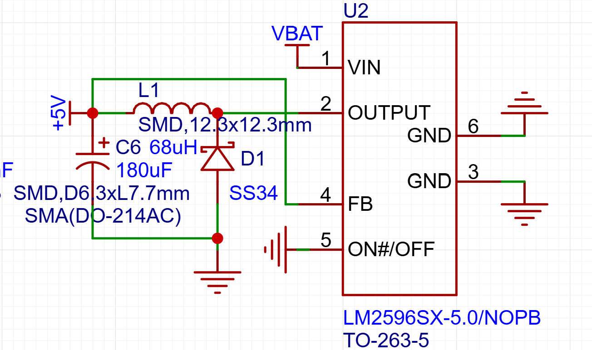

# Buck

## 状态

进行中

## 日期

- 开始日期：2026.9.6
- 最近更新：2026.9.6

## 理论知识

- 看了看BUCK降压电路，工作原理也是快速开关,一般都把电感电容肖特基都放在外面,简单说一下原理：开关接通的时候Vin-Vout大于0，根据电感V正比di/dt，电流上升，关闭时则电流下降,一个稳定周期内，电压近似不变，根据上升下降相同，得到deltaI的关系，推出占空比就是电压输出比，理论模型是这样，但是实际的buck芯片好复杂没有仔细看过啊，电容的作用是减弱三角纹波得到平滑的输出，具体的电感值和电容值都要根据纹波来算好像还没有很懂
  

## 实践

## 问题

## 参考资料

