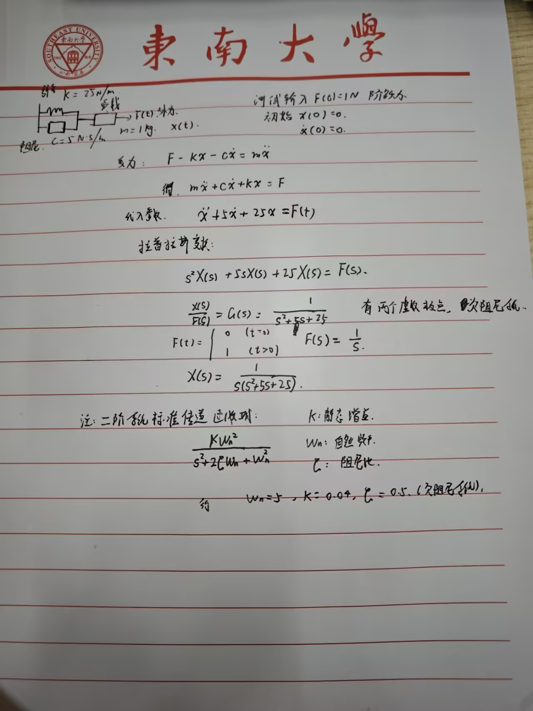
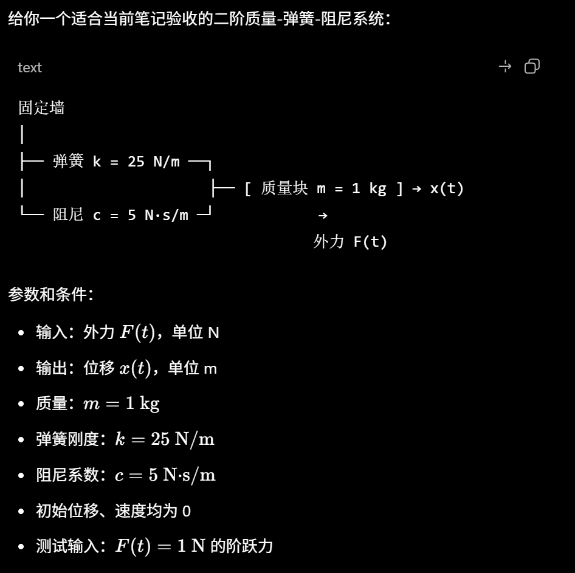

# 传递函数

## 状态

已完成

## 日期

- 开始日期：2026.7.31
- 最近更新：2026.7.31

## 理论知识

### 手写推导或设计

## 实践

[Simulink 模型](./secocnd_order_response.slx)

### 条件与参数

### 过程

- 使用单位阶跃输入，仿真时间为 0-10 s，两个积分器的初始值均为 0。
- 传递函数支路采用分母 `[1 5 25]`。
- 微分方程支路按 `x_ddot = F - 5*x_dot - 25*x` 搭建，并用两个积分器依次得到速度和位移。
- 使用 MATLAB R2024b 对两个输出采用相同的 10%-90% 定义计算上升时间。

### 结果与验收

| 验收项 | 目标值 | 实际值 | 是否通过 | 证据位置 |
|---|---:|---:|---|---|
| 稳态值 | 理论值 0.04 m；两模型相对误差 < 5% | 10 s 末值均为 0.0399999999998 m；相对误差 0% | 是 | [Simulink 模型](./secocnd_order_response.slx) |
| 10%-90% 上升时间 | 两模型相对误差 < 5% | 两者均为 0.343579915667 s；相对误差约 `4.85e-14%` | 是 | [Simulink 模型](./secocnd_order_response.slx) |
| 输出曲线一致性 | 两条曲线应重合 | 最大逐点绝对差约 `1.39e-17 m` | 是 | [Simulink 模型](./secocnd_order_response.slx) |

### 下一步

- [x] 完成微分方程模型与传递函数模型的阶跃响应对照。

## 问题

## 参考资料

- DR_CAN
